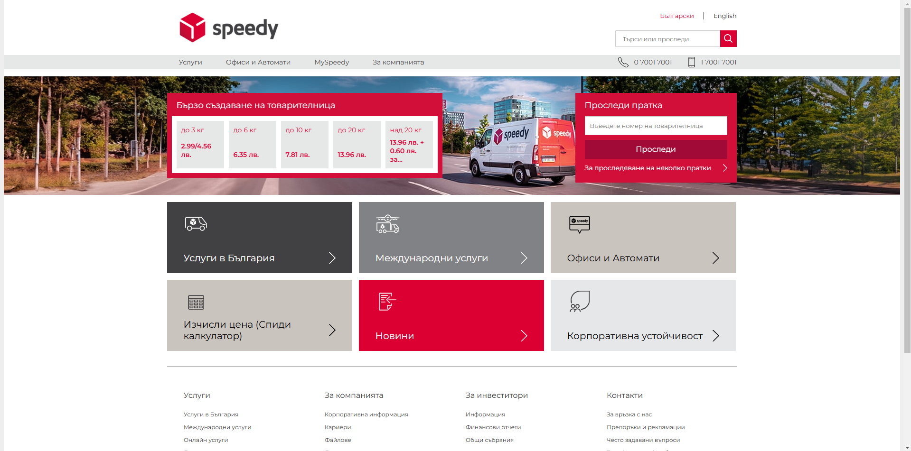
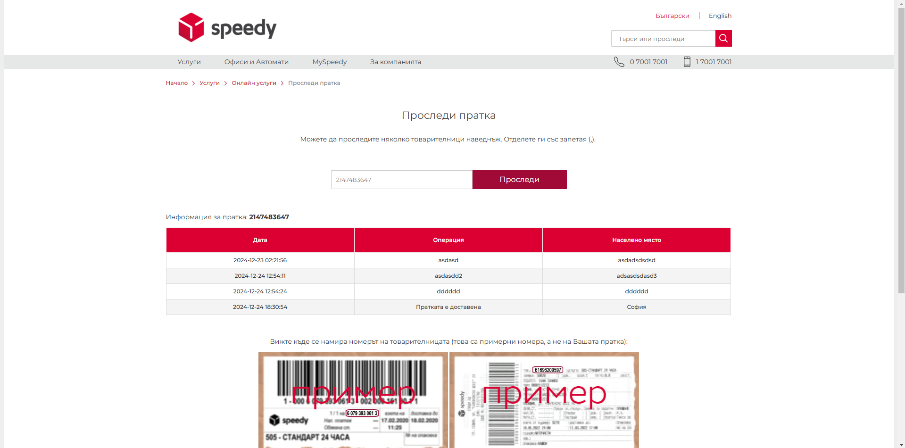
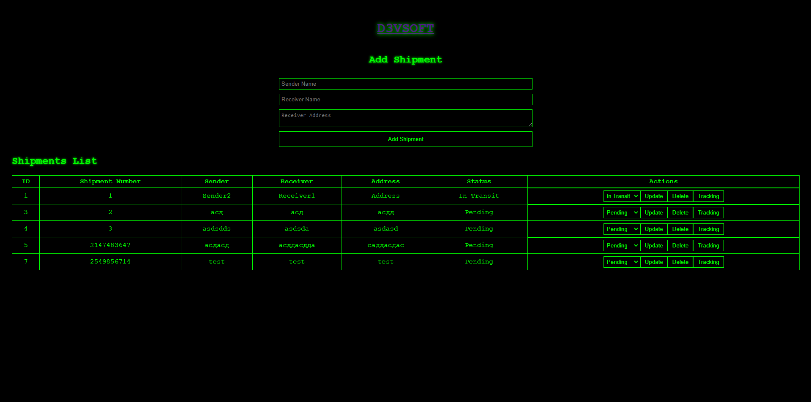
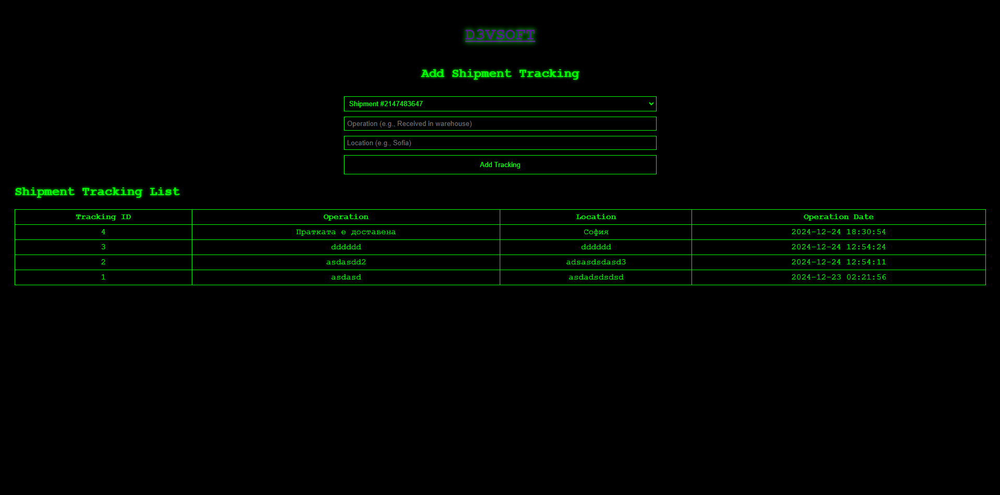

# Speedy.BG

**Speedy.BG** is a courier service management system developed by **D3VSOFT Ltd.** It offers a comprehensive platform to manage shipments, track deliveries, and streamline logistics operations.

---

## Screenshots





## Features
- User-friendly admin panel for managing shipments and users.
- Easy-to-install and use, with support for local development.
- Designed for small to medium-sized courier businesses.

---

## Requirements
- PHP 7.2
- MySQL

---

## Developer Details
- **Email:** admin@d3vsoft.com
- **Website:** https://d3vsoft.com

---

## Free Version Limitations
The free version of **Speedy.BG** works exclusively on `http://localhost`.

---

## Admin Panel Details
Access the admin panel to manage your shipments and settings:

- **URL:** [http://localhost/d3vsoft/](http://localhost/d3vsoft/)
- **Username:** `D3VSOFT`
- **Password:** `NmFgLoRnxGLEu2XdcD9PRutUNT`

> **⚠️ Security Notice:**  
> The default username and password are provided for demonstration purposes only. It is strongly recommended to update these credentials before using the system in a production environment.

---

## Installation
1. Clone the repository to your local server:
   ```bash
   git clone https://github.com/DeucalionCyberSecurity/speedy.bg.git
